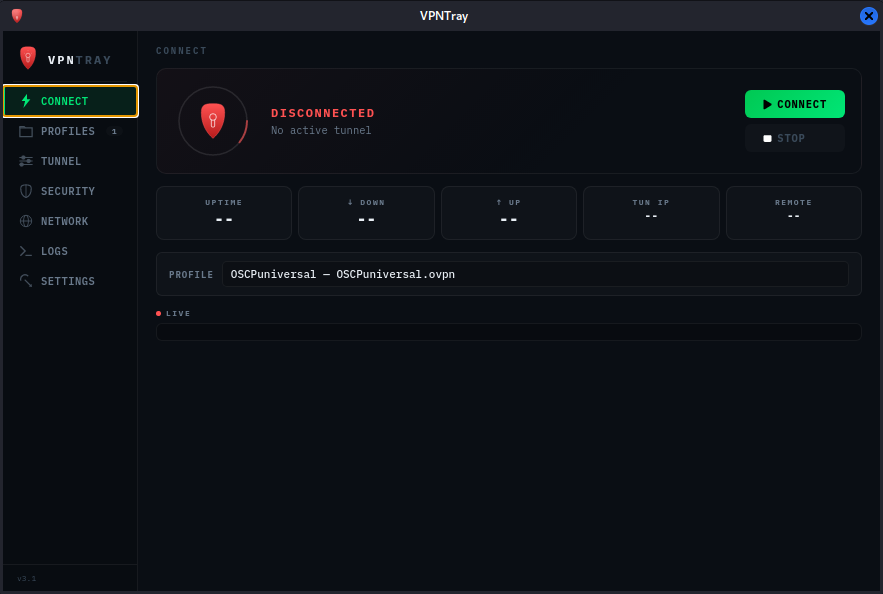
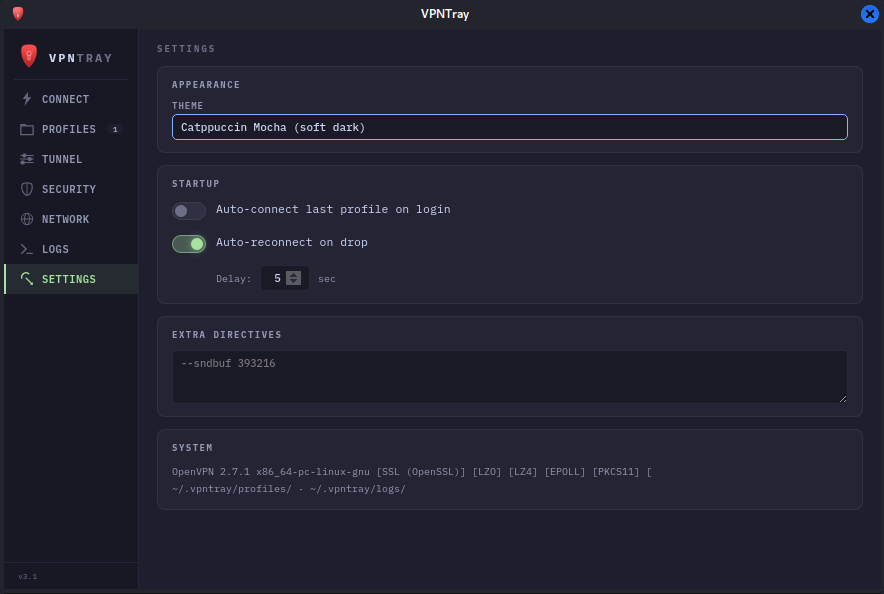
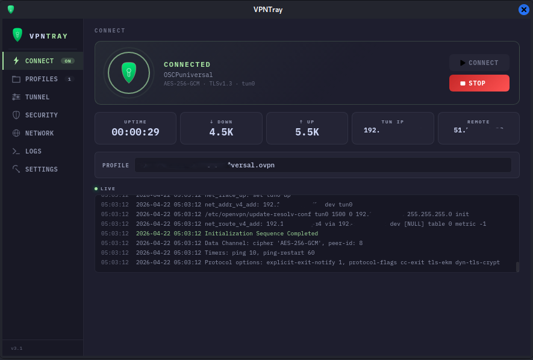

# vpntray
VpnTray: An OpenVPN system tray client for Linux. Import .ovpn profiles, connect from the system tray, see live stats, kill switch if you want it. 

Built because every OpenVPN GUI I tried on Kali was either broken in some way or kept me debugging instead of doing my work.


## Screenshots

### Default Theme


### Catpuccin Theme


### Connected Dashboard


### System Tray


## What it does

- System tray icon with connect/disconnect, quick-connect submenu
- Dashboard for profile management, tunnel overrides, logs
- Live stats: uptime, down/up bytes, TUN IP, remote IP (pulled from openvpn's management interface)
- Kill switch via iptables — blocks all non-VPN egress if the tunnel drops, LAN stays reachable
- Handles server-pushed soft restarts without resetting uptime
- Auto-reconnect on drop
- Full openvpn CLI coverage — cipher, auth digest, compression, MTU, MSSFix, keepalive, reneg-sec, proxy, pull-filter, custom routes, raw extra directives

## Install

```bash
git clone https://github.com/YOURNAME/vpntray
cd vpntray
sudo bash install.sh
```

Run with `vpntray` or find it in your app menu. First run also enables autostart.

## Requirements

- Linux (tested on Kali, should work on Debian/Ubuntu/Arch)
- Python 3.8+
- `openvpn`, `python3-pyqt5`, `python3-pyqt5.qtwebengine`
- Root for the openvpn process (installer sets up passwordless sudo for the launcher)

## Layout

```
~/.vpntray/
├── profiles/     # .ovpn files + referenced certs/keys
├── logs/         # per-session openvpn logs
└── state.json    # persisted settings
```

Drop `.ovpn` files into `~/.vpntray/profiles/` directly, or use the import button in the Profiles page (it also copies over referenced certs/keys from the source dir).


## Uninstall

```bash
sudo bash uninstall.sh
```

## License
BSD 3-Clause License
